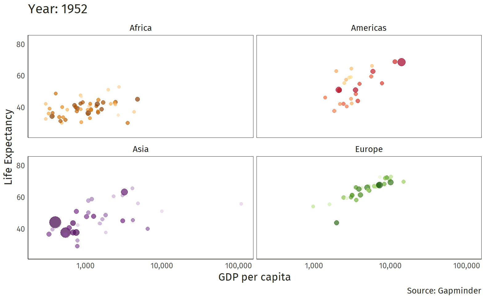
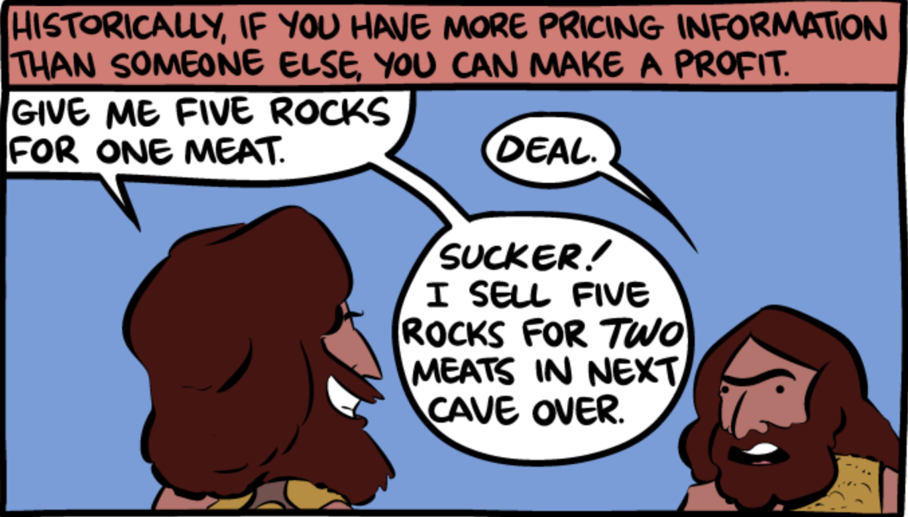
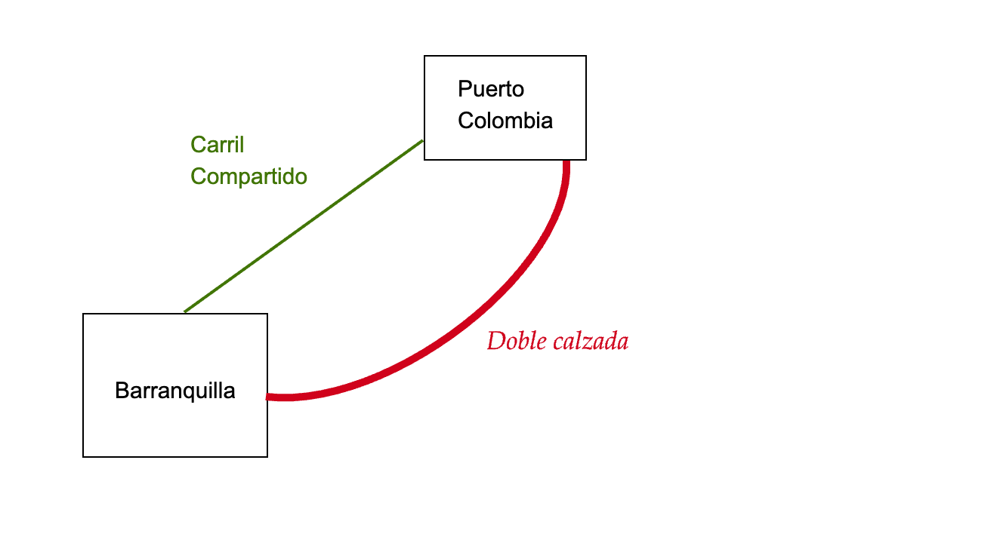
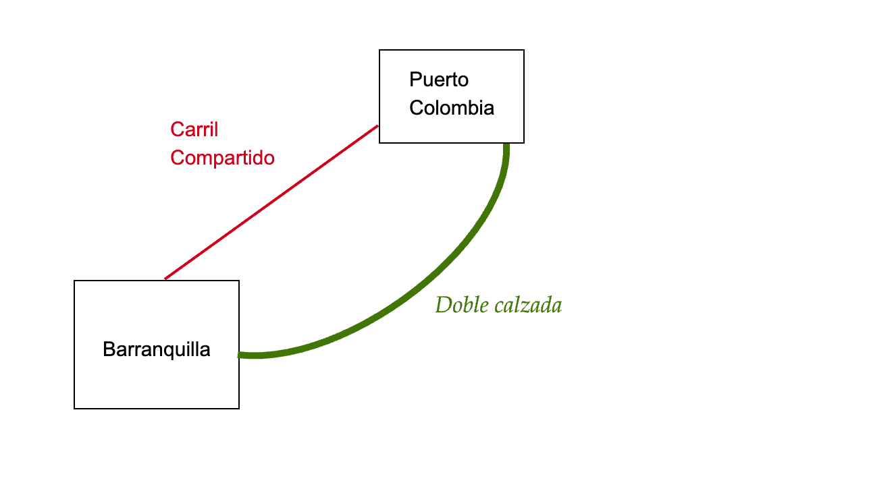
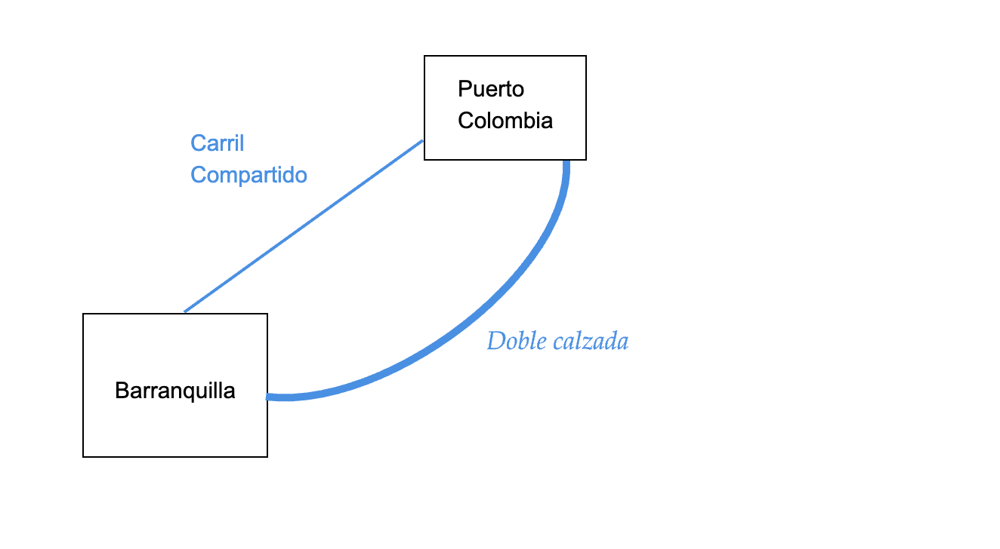

```{r setup}
#| include: false
#| message: false
#| warning: false
options(htmltools.dir.version = FALSE)
library(pacman)
p_load(tidyverse, scales, gapminder, ggiraph, patchwork, kableExtra, TSstudio,
       fontawesome, readxl, ggplot2, plotly, ggthemes, ggforce, viridis, knitr, hrbrthemes, ggeasy, ggrepel)
# Knitr options
opts_chunk$set(
  comment = "#>",
  fig.align = "center",
  fig.height = 7,
  fig.width = 10.5,
  warning = F,
  message = F,
  dpi=300
)

# Define colors
red_pink <- "#e64173"
met_slate <- "#272822" # metropolis font color 
purple <- "#9370DB"
green <- "#007935"
light_green <- "#7DBA97"
orange <- "#FD5F00"
turquoise <- "#44C1C4"
red <- "#b92e34"

theme_market <- theme_bw() + theme(
  axis.line = element_line(color = met_slate),
  panel.grid = element_blank(),
  rect = element_blank(),
  strip.text = element_blank(),
  text = element_text(family = "Fira Sans", color = met_slate, size = 17),
  axis.title.x = element_text(hjust = 1, size = 17),
  axis.title.y = element_text(hjust = 1, angle = 0, size = 17),
  axis.ticks = element_blank()
)

#theme_set(theme_ipsum_rc())
```

##  {background-color="black" background-image="https://media.giphy.com/media/8FVcs24aSuQBpHPg4n/giphy.gif" background-size="1000px"}

## Presentación

-   Como vamos?
-   Vamos a tratar de aprender algo
-   Pregunte por lo que no entienda
-   Formato de la clase (participación, comentarios y retarnos)

## Quién soy?

-   Profesor del Departamento de Economía
-   Preferencia por temas de innovación, data science, economía de la decisión y economía laboral
-   Correo: `cayanes@uninorte.edu.co`

{fig-align="right"}

## Esquema del Curso

-   Clases presenciales [la asistencia es importante]{.bg style="--col: #FFFF00"}
-   Notas y calificaciones:

::: fragment
Un cuadro que requiere de [atención]{.fg style="--col: #FF0000"} 🧐

| Requerimientos              | Fechas                | Ponderador         |
|-----------------------------|-----------------------|--------------------|
| Participación y discusión   | Durante todo el curso | 20%                |
| Taller y estudios de caso   | A solicitud           | 30%                |
| Proyecto aplicado           | Parte final           | 30%                |

♠ Las [notas]{.fg style="--col: #FF8000"} de participación son individuales. Los talleres y Proyecto si pueden ser en grupo de pocos integrantes.
:::

## Esquema del Curso

-   Dedicado a analizar y presentar datos e información microeconomica y macroeconómica.
-   Las clases tienen [Ejemplos]{.fg style="--col: #FF8000"}, para mejorar la *explicación o dar mayor claridad*. La parte concerniente de [Trabajos en clases]{.fg style="--col: #FF8000"} son actividades complementarias a la formación de lo/as estudiantes.
-   Por ello, [este curso]{.fg style="--col: #FF8000"} combinará [principios teóricos]{.fg style="--col: #0000FF"} con análisis del mundo real. De este modo, podrá tener un espectro mayor de análisis de las cosas.

## Fuentes de información

::: fragment
{width="50%"}
:::

##  {background-image="imagenese/home.jpg"}

### Conceptos básicos {.r-fit-text}

## Conceptos básicos

-   Una buena guía de abordaje del tema de economia esta en : [libros de Openstax](https://openstax.org/subjects/social-sciences)
-   No se puede olvidar la [definición de economía]{.fg style="--col: #e64173"}

:::: fragment
::: callout-warning
La economía analiza las decisiones de la sociedad y cómo esas decisiones del presente y del pasado se reflejan en los resultados del futuro.
:::
::::

-   Independientemente de la definición que usted elija, lo más importante es que estudiar **Economía** proporciona un conjunto de herramientas para analizar *críticamente* los [problemas sociales]{.fg style="--col: #FF8000"} en sus aspectos económicos cuantitativos y cualitativos.

## Conceptos básicos

-   Tenga en cuenta el siguiente ejercicio:

:::: fragment
::: callout-important
## Ejercicio

Hace unos 30 años, una cesta de bienes tales como (huevos, leche, pollo y mantequilla) costaban unos \$500. Hoy, esa misma cesta puede costar unos 290.000 mil pesos COP.
:::
::::

::: fragment
[¿Qué ha **cambiado** desde entonces?]{.bg style="--col: #dcdcdc"}
:::

## Conceptos básicos

```{r}
#| label: fig-inflaction
#| warning: false
#| echo: false
# Crear un conjunto de datos de ejemplo
inflacion <- data.frame(
  Pais = c("Colombia", "Brasil", "Perú", "Chile", "Argentina", "Ecuador", "Bolivia", "Mexico",
           "Colombia", "Brasil", "Perú", "Chile", "Argentina", "Ecuador", "Bolivia", "Mexico"),
  periodo = c(rep(2022, 8), rep(2025, 8)),
  Valor = c(
    # 2022
    10.18, 9.28, 7.87, 11.65, 72.43, 3.47, 1.75, 7.90,
    # 2025 (agosto, interanual)
    5.10, 5.13, 1.11, 4.00, 33.60, 0.81, 24.15, 3.57
  ))
inflacion$Pais <- factor(inflacion$Pais)

p1 <- ggplot(inflacion[inflacion$periodo == 2022,], 
             aes(y = reorder(Pais, Valor), 
                 x=Valor,
                 tooltip = Valor,
                 data_id = Pais)) +
  geom_bar_interactive(stat="identity", 
                       fill="steelblue") +
  labs(y="", x="2022") + 
  theme_minimal()

p2 <- ggplot(inflacion[inflacion$periodo == 2025,], 
             aes(y = reorder(Pais, Valor), 
                 x=Valor,
                 tooltip = Valor,
                 data_id = Pais)) +
  geom_bar_interactive(stat="identity", 
                       fill="steelblue") +
  labs(y="", x="2023") + 
  theme_minimal()

p3 <- (p1 | p2) +
  plot_annotation(title = "Inflación en la región (2022- 2025)")
girafe(code = print (p3)) 
```

## Conceptos básicos

-   `r fa("donate", fill="red")` El principal [problema]{.alert} en economía es que hay que reconocer que todo es **escaso**.

-   El agua, los bosques, el cobre, los osos pandas, el aire limpio.

-   El tiempo, la calidad de de vida (*medido en esperanza*), la concentración.

::: fragment
> No existen los suficientes bienes para satisfacer las necesidades ilimitadas de los individuos. (Escasez)
:::

-   Sin embargo... por lo pronto nos las arreglamos

## Conceptos básicos

::: fragment

:::

# Descripción

:::: fragment
::: callout-note
## Descripción del curso

Este curso proporciona los principios de economía para tener presente en la evaluación de proyectos, centrado exclusivamente en los conceptos de la economía en general utilizando elementos básicos de **cálculo diferencial** 😢 y de alguna manera de la [estadística]{.oranger} 😬
:::
::::

::: fragment
`r fa("exclamation-triangle")` Se hace énfasis en el lenguaje [matemático]{.alert}.
:::

##  {background-image="imagenese/home.jpg"}

### Teoría Económica {.r-fit-text}

## Teoría Económica

::: fragment
> Estudia el proceso de **producción** y *distribución* de los bienes y servicios elaborados en la sociedad, desde los puntos de vista micro y macroeconómico.
:::

:::::: fragment
::::: columns
::: {.column width="50%"}
-   Desde la [microeconomía]{.blut} se estudia la conducta de los agentes económicos **individuales**, los mercados y sus interrelaciones, a través del análisis de las variables que afectan los [precios “relativos”]{.bg style="--col: #FFFF00"} de los bienes y servicios.
:::

::: {.column width="50%"}
Desde la [macroeconomía]{.oranger} se estudia el funcionamiento de la economía con base al [nivel general de precios]{#FF8000 .fg style="\"--col:"}.
:::
:::::
::::::

## Teoría Económica

::::: columns
::: {.column width="60%"}
-   ¿Qué es una "economía"?
-   ¿De dónde surgen los agregados ("PIB", "desempleo" e "inflación")?
-   [Microeconomía]{.alert}: Opciones y consecuencias
-   [Macroeconomía]{.blut}: Interacción sistémica de los tomadores de decisiones y comportamiento emergente
:::

::: {.column width="40%"}

:::
:::::

## Teoría Económica

### Microeconomía

::: fragment
```{r, echo = F}
interp1 <- tibble(
  analiza = c("Conducta de los Consumidores",
             "Conducta Productores",
             "Precios relativos",
             "Conducta del Estado"),
  Basa =c("Curva de Demanda", "Curva de oferta", "Oferta-Demanda", "Control y regulación"),
  Determina =c("Teoría de la Utilidad", "Teoría de la Producción", "Elasticidad", "Regulación")) %>% 
  kable(
  escape = F,
  col.names = c("Analiza", "Se basa en", "Determina"),
  align = c("l", "l", "l")) %>% 
  column_spec(1, color = "black", bold = T, italic = T, extra_css = "vertical-align:top;") %>% 
  column_spec(2, color = "black", italic = T) %>% 
  column_spec(3, color = "red", italic = T)
interp1
```
:::

## Teoría Económica

### Economistas parece que hablan un idioma raro...

-   Términos que "conoce" de la vida cotidiana tienen [significados]{.bg style="--col: #00FFFF"} muy diferentes para los **economistas**

-   Costo, eficiencia, bienestar, competencia, marginal, equilibrio, ganancia, bien público, discriminación, elasticidad

-   Usar los significados "ordinarios" de estas palabras puede llevar a [conclusiones económicas]{.fg style="--col: #314f4f"} incorrectas!

:::: fragment
::: callout-tip
## idea

¡Necesita "aprender" los significados económicos de estas palabras!
:::
::::

## Teoría Económica

### Jerga económica

:::::: fragment
::::: columns
::: {.column width="50%"}
> Tasa marginal de sustitución, costo marginal, excedente del consumidor, eficiencia asignativa, externalidad
:::

::: {.column width="50%"}

:::
:::::
::::::

##  {background-image="imagenese/home.jpg"}

### Incentivos {.r-fit-text}

## Incentivos

::: fragment
{width="100%"}
:::

## Incentivos

### Las personas, instituciones, responden a estimulos

:::: fragment
::: callout-note
## Incentivo

Es un estímulo o recompensa que se ofrece para **motivar** a una persona o grupo a realizar una acción específica o comportarse de cierta manera. Los incentivos pueden ser [positivos]{.alert}, como bonificaciones o premios, o negativos, como multas o sanciones, y son utilizados para alinear los intereses individuales con los objetivos organizacionales o sociales.
:::
::::

-   La gente responde a los [incentivos]{.under}:

::: fragment
> Dinero, castigo, impuestos y subsidios, riesgo de lesiones, reputación, ganancias, género, esfuerzo, moral
:::

-   Los entornos se ajustan hasta que están en **equilibrio**

## Incentivos

-   La gente ajusta sus elecciones hasta que sean [óptimas]{.fg style="--col: #314f4f"}, dadas las acciones de los demás.

-   Suponga por ejemplo:

::: fragment
[El gobierno nacional ofrece un *subsidio* de \$3500 por cada cola de ratón que entreguen las personas]{.fg style="--col: #e64173"}. ¿Qué creen que ocurrirá?
:::

::: fragment
{width="30%"}
:::

## Incentivos

::::::: columns
::::: {.column width="50%"}
::: fragment

:::

::: fragment
[¡Consecuencias no intencionadas!]{.fg style="--col: #FF0000"}
:::
:::::

::: {.column width="50%"}
-   La gente responde a (cambios en) los **incentivos**.
-   La gente tiene metas/objetivos que busca alcanzar.
-   Hacer que una [alternativa]{.oranger} sea más costosa no significa que la gente [deje]{.under} de perseguir/conseguir sus metas.
-   La gente [buscará métodos alternativos]{.blut} (menos preferidos) para alcanzar sus metas.
:::
:::::::

## Incentivos

:::::: columns
::: {.column width="50%"}
-   La cultura del atajo siempre va estar presente, inclusive en los proyectos que deba designar o realizar.
-   La/s personas/gente buscaran la manera de bloquear o saltar
-   Siempre inclusive hay que tratar de resolver con creativos nudges
:::

:::: {.column width="50%"}
::: fragment

:::
::::
::::::

## incentivos

::: fragment
<iframe width="560" height="315" src="https://www.youtube.com/embed/0i4vQVP_B6U?si=wOhEGZxqslBU0j5C" title="YouTube video player" frameborder="0" allow="accelerometer; autoplay; clipboard-write; encrypted-media; gyroscope; picture-in-picture; web-share" referrerpolicy="strict-origin-when-cross-origin" allowfullscreen>

</iframe>
:::

##  {background-image="imagenese/home.jpg"}

### Equilibrio {.r-fit-text}

## Equilibrio

::::: columns
::: {.column width="65%"}

:::

::: {.column width="35%"}
`r fa("bell", fill="red")` Suponga que hay 2 caminos que conectan a Puerto Colombia con Barranquilla

`r fa("bell", fill="red")` 100 carros transitan

`r fa("bell", fill="red")` Tiempo en *carril compartido* : 15 min + 1 min/carro

`r fa("bell", fill="red")` **Doble calzada** 20 minutos (siempre)
:::
:::::

## Equilibrio

::::: columns
::: {.column width="65%"}

:::

::: {.column width="35%"}
`r fa("bell", fill="red")` Suponga que hay 2 caminos que conectan a Puerto Colombia con Barranquilla

`r fa("bell", fill="red")` 100 carros transitan

`r fa("bell", fill="red")` Tiempo en *carril compartido* : 15 min + 1 min/carro

`r fa("bell", fill="red")` **Doble calzada** 20 minutos (siempre)

`r fa("bell", fill="blue")` [Optimización]{.fg style="--col: #e64173"}: Van a *escoger* el camino que minimiza [el tiempo]{.under}
:::
:::::

## Equilibrio

::::: columns
::: {.column width="65%"}

:::

::: {.column width="35%"}
`r fa("bell", fill="red")` Suponga que hay 2 caminos que conectan a Puerto Colombia con Barranquilla

`r fa("bell", fill="red")` 100 carros transitan

`r fa("bell", fill="red")` Tiempo en *carril compartido* : 15 min + 1 min/carro

`r fa("bell", fill="red")` **Doble calzada** 20 minutos (siempre)

`r fa("bell", fill="blue")` [Escena 1]{.fg style="--col: #e64173"}: Menos de **30 carros** en carril
:::
:::::

## Equilibrio

::::: columns
::: {.column width="65%"}

:::

::: {.column width="35%"}
`r fa("bell", fill="red")` Suponga que hay 2 caminos que conectan a Puerto Colombia con Barranquilla

`r fa("bell", fill="red")` 100 carros transitan

`r fa("bell", fill="red")` Tiempo en *carril compartido* : 15 min + 1 min/carro

`r fa("bell", fill="red")` **Doble calzada** 20 minutos (siempre)

`r fa("bell", fill="blue")` [Escena 2]{.fg style="--col: #e64173"}: Mas de **30 carros** en carril
:::
:::::

## Equilibrio

::::: columns
::: {.column width="65%"}

:::

::: {.column width="35%"}
`r fa("bell", fill="red")` Suponga que hay 2 caminos que conectan a Puerto Colombia con Barranquilla

`r fa("bell", fill="red")` 100 carros transitan

`r fa("bell", fill="red")` Tiempo en *carril compartido* : 15 min + 1 min/carro

`r fa("bell", fill="red")` **Doble calzada** 20 minutos (siempre)

`r fa("bell", fill="blue")` [Equilibrio]{.fg style="--col: #e64173"}: Cuantos Carros debe haber en cada vía(?), Por?
:::
:::::

## Equilibrio

::::::: columns
::: {.column width="65%"}

:::

::::: {.column width="35%"}
`r fa("bell", fill="red")` Suponga ahora que el estado interviene y doblega el carril normal

`r fa("bell", fill="red")` Tiempo en *carril compartido* : [15 min + 0.5 min/carro]{.blut}

`r fa("bell", fill="red")` **Doble calzada** 20 minutos (siempre)

::: fragment
[Esto reduce el tiempo de viaje?]{.bg style="--col: #00FFFF"}
:::

::: fragment
Si!!, 30 carros antes se gastaban 20 minutos ahora solo 15 min!!
:::
:::::
:::::::

## Equilibrio

<blockquote class="twitter-tweet">

<p lang="en" dir="ltr">

1970: One more lane will fix it.<br>1980: One more lane will fix it.<br>1990: One more lane will fix it.<br>2000: One more lane will fix it.<br>2010: One more lane will fix it.<br>2020: ?<a href="https://t.co/NjS1IPORG2">pic.twitter.com/NjS1IPORG2</a><br>via <a href="https://twitter.com/avelezig?ref_src=twsrc%5Etfw">@avelezig</a>

</p>

— Urban Planning & Mobility 🚲🚶 ♂️🚆 (@urbanthoughts11) <a href="https://twitter.com/urbanthoughts11/status/1191295205187686400?ref_src=twsrc%5Etfw">November 4, 2019</a>

</blockquote>

```{=html}
<script async src="https://platform.twitter.com/widgets.js" charset="utf-8"></script>
```

## Equilibrio

::: fragment
> **Estática comparativa**: examinar los cambios en los equilibrios provocados por un cambio externo (en los incentivos, las restricciones, etc.).
:::

::: fragment
```{mermaid}
%%| fig-width: 12.0
flowchart LR
  A(Equilibrio 1) --> B{Cambio en el sistema}
  B --> C(Equilibrio 2)
```
:::

## Equilibrio

-   Las [personas]{.alert} aprenden todo el *tiempo* e inclusive [cambian]{.blut} su comportamiento. Siempre buscan o "tienden" a buscar la opción de mayor valor

-   Si no hay mejores [alternativas]{.blut}, entonces podemos decir que esa persona se encuentra en un [**optimo**]{.fg style="--col: #e64173"}

:::: fragment
::: callout-tip
## Pendiente!

Todo estará en un optimo $\Leftrightarrow$ el sistema esta en **equilibrio**
:::
::::

## [Todo esto es raro...]{style="font-size: 80px; font-family: Brusher;"} {.center}

::: incremental
-   **Economía**: *Un sistema donde se coordinan las actividades productivas de una sociedad*

-   **Economía de Mercado**: *Es una economía donde se toman decisiones de producción y consumo de bienes y servicios*

-   **Mano invisible**: *La forma en la cual los individuos persiguen a como de lugar su propio bienestar, sin embargo eso conlleva a resultados mejores para una sociedad como un todo*
:::

##  {background-image="imagenese/home.jpg"}

### Matemáticas en economía {.r-fit-text}

## Repaso Matemático

::::: columns
::: {.column width="50%"}

:::

::: {.column width="50%"}
-   Los economistas suelen «hablar» en modelos que explican y predicen el [comportamiento humano]{.oranger}

-   El lenguaje puro de los modelos son las [matemáticas]{.under}

-   Cosas que son universalmente ciertas, deducibles a partir de axiomas, pueden detectar errores fácilmente a menudo ecuaciones y gráficos esto es lo que más asusta a muchas personas que quieren aprender de economía
:::
:::::

## Repaso Matemático

::: fragment
`r fa("angle-double-right", fill="blue")` **Considere la siguiente expresión**:
:::

::: fragment
<font size="+5">$$2+2=4$$</font>
:::

::: fragment
[Cualquiera puede hacerlo...]{style="font-size:larger;"}
:::

::: fragment
`r fa("angle-double-right", fill="blue")` **Ahora mire a continuación**:
:::

::: fragment
<font size="+5">$$2+2=\sqrt{16}$$</font>
:::

::: fragment
[No todos pueden hacerlo...]{style="font-size:larger;"}
:::

## Repaso Matemático

::: fragment
`r fa("angle-double-right", fill="blue")` **Nuevamente mire a continuación**:

<font size="+5">$$3!-\left[1+\sum \limits_{p=1}^{\infty}\frac{1}{2^{p}}\right]=\sqrt{16}$$</font>
:::

::: fragment
[Ahora si que pocos podrán hacerlo...]{style="font-size:larger;"}
:::

-   `r fa("angellist")` Conociendo de lo anterior ya usted tiene varias formas de obtener una [respuesta]{.alert}.

## Repaso Matemático

-   Que tan bueno deriva(?)
-   Muchas cosas se miden con cambios, por ello se hace uso de las derivadas.
-   Mire a continuación la siguiente expresión:

::: fragment
$$f(x)=2x^2-3x-y$$
:::

-   Derive con respecto a (x), es decir halle $f'(x)$

-   La respuesta es $f'(x)=4x+3$

-   Los economistas a veces la igualan a cero (0). Con eso podrá obtener el máximo o el mínimo de una función.

## Repaso Matemático

::: fragment
- Imagine que esta evaluando un proyecto productivo (ejemplo: una pequeña planta que fabrica botellas).

- El beneficio neto (ganancia) depende de cuántas botellas produzca. Una función simplificada de beneficios podría ser:
:::

::: fragment
$$B(x) = -2x^2 + 40x - 100$$
:::

::: fragment
Donde $B$ es el Beneficio y $x$ es el número en miles de botellas que debe producir.
:::


## Repaso Matemático

```{r}
#| echo: False
#| message: False
#| warning: False


# Beneficio de un proyecto (en miles de pesos) según producción x (miles de unidades)
B <- function(x) -2*x^2 + 40*x - 100

# Óptimo vía derivada: B'(x) = -4x + 40 -> -4x + 40 = 0 => x* = 10
x_opt <- 10
B_opt <- B(x_opt)

# Secuencia para graficar
x <- seq(0, 20, by = 0.1)
y <- B(x)

# Gráfico base
plot(x, y, type = "l",
     xlab = "Producción (miles de unidades)",
     ylab = "Beneficio (miles de pesos)",
     main = "Curva de beneficio y punto óptimo")

# Punto óptimo y anotación
points(x_opt, B_opt, pch = 19)
text(x_opt + 1, B_opt + 20,
     labels = paste0("Óptimo: x=", x_opt, ", B=", B_opt),
     adj = c(0, 0))
abline(v = x_opt, lty = 2)
abline(h = B_opt, lty = 3)

# Impresión de resultados en consola
cat("Óptimo de producción (miles de unidades):", x_opt, "\n")
cat("Beneficio máximo (miles de pesos):", B_opt, "\n")
```

## Repaso Matemático

::: fragment
**P**: De donde salió lo anterior?
:::

::: fragment
**R./**: Del poder de una [**ecuación**]{.bg style="--col: #00FFFF"}
:::

::: fragment

$$B(x) = -2x^2 + 40x - 100$$
*Derivamos e igualamos a cero*

$$B'(x) = \frac{d}{dx}(-2x^2 + 40x - 100) = -4x + 40$$

$$-4x + 40 = 0 \quad ; \quad 40=4x ;\quad x = \frac{40}{4} = 10$$

:::

## Repaso Matemático

-   Piense por un momento en lo siguiente:

::: fragment
Está planeando un viaje a Bogotá. Para llegar, puede coger un bus o volar. El Bus de Barranquilla a Bogotá tarda 14 horas y cuesta 130 mil pesos. Un vuelo de Barranquilla a Bogotá tarda 1 hora y cuesta 970 mil pesos el billete. Decide coger el Bus. ¿Cuánto valoras tu tiempo?
:::

::: fragment
Su elección de ir en bus $\Rightarrow$ es menos costosa que ir en avión $$14\;\text{horas}+130000\leq1\; \text{hora} + 970000$$
:::

::: fragment
Vamos a restar 130 mil de cada lado $$14\;\text{horas}\leq1\; \text{hora} + 840000$$
:::

## Repaso Matemático

::: fragment
Despejamos las horas (uso de términos cómunes) $$14\;\text{horas}- 1\text{hora}\leq\;840000$$
:::

::: fragment
Solo queda restar y dividir $$13\;\text{horas}\leq\;840000$$
:::

::: fragment
> Note que $1\; \text{hora}\leq 64615$
:::

##  {background-image="imagenese/leaf.jpg"}

### Presupuesto {.r-fit-text}

## Presupuesto

:::::: columns
::: {.column width="60%"}
-   Piense que usted desea dos bienes
-   Estos son $\{X, Y\}$
-   Las cantidades son 2 y 3 respectivamente
:::

:::: {.column width="40%"}
::: fragment
```{r, echo=F, message = F, warning = F, fig.height=12.3, fig.align="center"}
df <- tribble(
  ~x, ~y,
  2, 3
)

ggplot(df, aes(x = x,
               y = y))+
  geom_point(size =3)+
  geom_text(aes(x=2,y=3.5), label="(2,3)", size=7)+
  geom_segment(x=0, xend=2, y=3, yend=3, linetype="dotted", size =1)+
  geom_segment(x=2, xend=2, y=0, yend=3, linetype="dotted", size =1)+
  scale_x_continuous(breaks = seq(0,10,1), 
                     limits = c(0,10),
                     expand = c(0,0))+
  scale_y_continuous(breaks = seq(0,10,1), 
                     limits = c(0,10),
                     expand=c(0,0))+
  theme_classic(base_family = "Fira Sans Condensed", base_size=20)
```
:::
::::
::::::

## Presupuesto

::::: columns
::: {.column width="50%"}
-   Si tiene 100 y desea gastarlo en $\{X,Y\}$, cuantas unidades serian?
-   Solo aquellos que sean *asequibles*
-   El presupuesto es una línea que se representa como $m$
:::

::: {.column width="50%"}

:::
:::::

##  {background-image="imagenese/leaf.jpg"}

### Frontera de Posibilidades de Producción {.r-fit-text}

## Frontera de Posibilidad de Producción

::: fragment
```{r datagr1, include=FALSE}
library(econocharts)
p <- ppf(x = 4:6, # Intersections
         main = "Frontera de posibilidad de Producción",
         geom = "text",
         generic = TRUE, # Generic labels
         labels = c("A", "B", "C"), # Custom labels
         xlab = "Motos",
         ylab = "Autos",
         acol = 3)      # Color of the area
```

```{r, ex1, echo=FALSE, fig.height=5}
p$p + geom_point(data = data.frame(x = 5, y = 5), size = 5) +
  geom_point(data = data.frame(x = 2, y = 2), size = 5) +
  annotate("segment", x = 3.1, xend = 4.25, y = 5, yend = 5,
           arrow = arrow(length = unit(0.5, "lines")), colour = 3, lwd = 1) +
  annotate("segment", x = 4.25, xend = 4.25, y = 5, yend = 4,
           arrow = arrow(length = unit(0.5, "lines")), colour = 3, lwd = 1)
```
:::

## Frontera de Posibilidad de Producción

::: fragment
Suponga que un **país** cuenta con producción especifica de Automomoviles y Motos.
:::

::: fragment
*Opción A*: Producir 20 Autos y 200 Motos *Opción B*: Producir 25 Autos y 160 Motos
:::

::: fragment
Calcule el costo de oportunidad de un automóvil frente a los (motos):
:::

::: fragment
$$\frac{(25-20)}{(160-200)}=\frac{5}{-40}=-0.125$$
:::

## Frontera de Posibilidad de Producción

::: fragment
Ahora el costo de oportunidad de los motos frente a los autos:
:::

::: fragment
$$\frac{(160-200)}{(25-20)}=\frac{-40}{5}=-8$$
:::

::: fragment
> Para producir un automóvil debe renunciar a 8 unidades de motos
:::

::: fragment
Ademas en sentido contrario
:::

::: fragment
> Para producir una moto debe renunciar a 0.125 unidades de Autos
:::

## Gracias! por su atención {.center}

#### Alguna pregunta adicional?

Slides de la clase:

`r fa('link')` [Curso virtual](https://cursos.uninorte.edu.co/d2l/home/109780)

`r fa('github')` [keynes37](https://github.com/keynes37)

## Bibliografía {.center}

`r fa('book')` Mankiw, N. G. (2005). *Principios de microeconomía* /N. Gregory Mankiw (No. 338.5 M55Y.).

`r fa('archive')` Lecture notes Ryan Safner

`r fa('book')` Krugman, P., & Wells, R. (2014). *Microeconomics (for AP)*. New York: Worth Publishers.

`r fa('book')` Mokate, K., & Castro, R. (2018). *Evaluación económica y social de proyectos de inversión*: Segunda edición. Universidad de los Andes.
