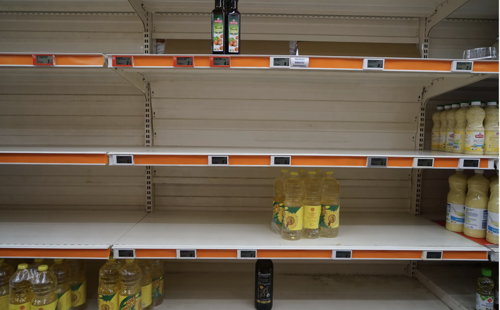
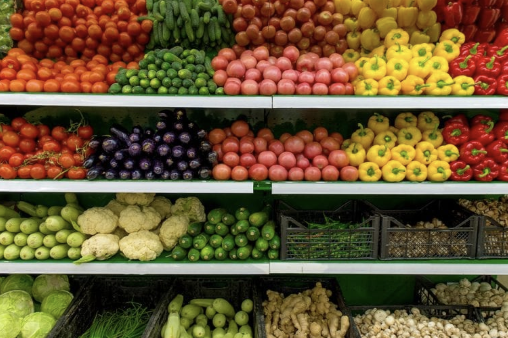
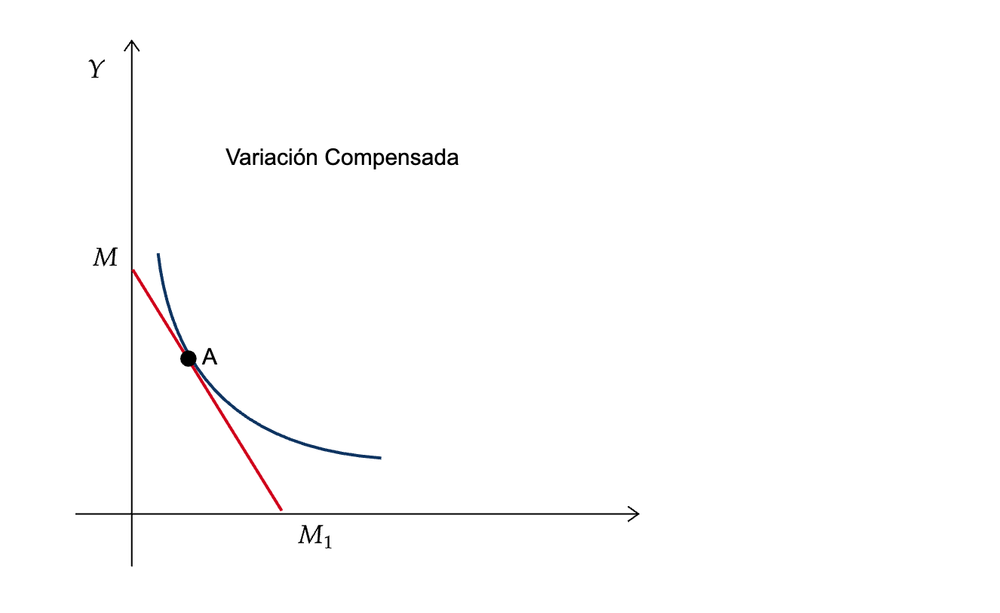
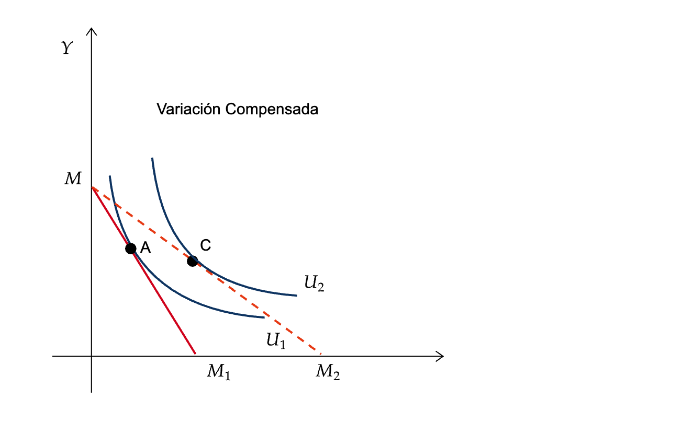
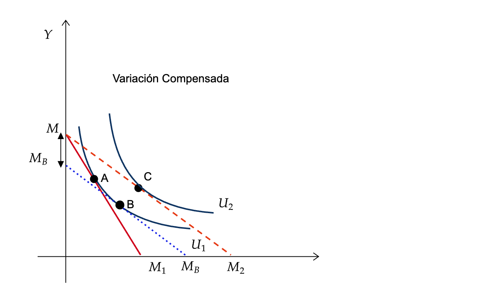
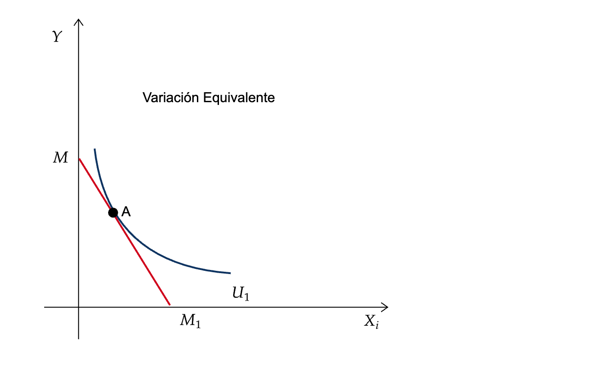
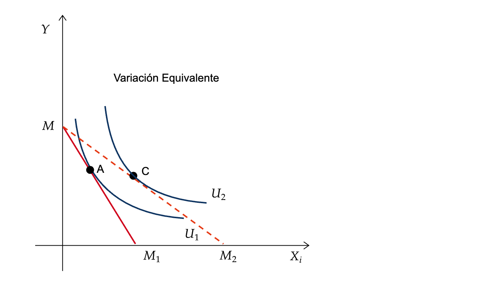
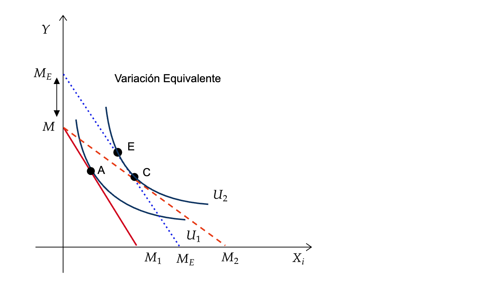

```{r setup}
#| include: false
options(htmltools.dir.version = FALSE)
library(pacman)
p_load(tidyverse, scales, gapminder, ggiraph, patchwork, kableExtra, TSstudio,
       fontawesome, readxl, ggplot2, plotly, ggthemes, ggforce, viridis, knitr, hrbrthemes, ggeasy, ggrepel)
# Define colors
red_pink <- "#e64173"
met_slate <- "#272822" # metropolis font color 
purple <- "#9370DB"
green <- "#007935"
light_green <- "#7DBA97"
orange <- "#FD5F00"
turquoise <- "#44C1C4"
red <- "#b92e34"

# Knitr options
opts_chunk$set(
  comment = "#>",
  fig.align = "center",
  fig.height = 7,
  fig.width = 10.5,
  #dpi = 300,
  #cache = T,
  warning = F,
  message = F
)  
theme_simple <- theme_bw() + theme(
  axis.line = element_line(color = met_slate),
  panel.grid = element_blank(),
  rect = element_blank(),
  strip.text = element_blank(),
  text = element_text(family = "Fira Sans", color = met_slate, size = 17),
  axis.text.x = element_text(size = 12),
  axis.text.y = element_text(size = 12),
  axis.ticks = element_blank()
)
theme_market <- theme_bw() + theme(
  axis.line = element_line(color = met_slate),
  panel.grid = element_blank(),
  rect = element_blank(),
  strip.text = element_blank(),
  text = element_text(family = "Fira Sans", color = met_slate, size = 17),
  axis.title.x = element_text(hjust = 1, size = 17),
  axis.title.y = element_text(hjust = 1, angle = 0, size = 17),
  # axis.text.x = element_text(size = 12),
  # axis.text.y = element_text(size = 12),
  axis.ticks = element_blank()
)
theme_gif <- theme_bw() + theme(
  axis.line = element_line(color = met_slate),
  panel.grid = element_blank(),
  rect = element_blank(),
  text = element_text(family = "Fira Sans", color = met_slate, size = 17),
  axis.text.x = element_text(size = 12),
  axis.text.y = element_text(size = 12),
  axis.ticks = element_blank()
)
wrapper <- function(x, ...) paste(strwrap(x, ...), collapse = "\n")
# functions
demand <- function(x) 10 - x
demand_2 <- function(x) 9 - x
demand_3 <- function(x) 8 - x
demand_inc <- function(x) 11 - x
demand_dec <- function(x) 5 - x
supply <- function(x) 1 + (4/5)*x
step_demand <- data.frame(x = c(0, 1, 2, 3, 4, 5, 6, 7, 8), mv = c(8, 7, 6, 5, 4, 3, 2, 1, 0))

### tag
library(mosaic)
update_geom_defaults("label", list(family = "Fira Sans Condensed"))
update_geom_defaults("text", list(family = "Fira Sans Condensed"))

```

##  {background-color="black" background-image="https://i.giphy.com/media/v1.Y2lkPTc5MGI3NjExcDZtdjU1dTd4MmV5N3MxbTJzeHBycmdwM2U0anI2dGswODkzdzM2NiZlcD12MV9pbnRlcm5hbF9naWZfYnlfaWQmY3Q9Zw/mW05nwEyXLP0Y/giphy.gif"}

# Preguntas de la sesión anterior?

## Preferencias

::::::: columns
:::: {.column width="30%"}
-   Cuál de las siguientes cestas **prefiere** sobre cualquier otra?
-   Ejemplo de dos cestas $(x,y):$

::: fragment
$$a=(2,5) \quad \text{o} \quad b=(6,4)$$
:::
::::

:::: {.column width="70%"}
::: fragment
```{r}
#| echo: false
# Definir la función de utilidad más convexa y más baja
indifference_curve <- function(x) {
  return(2 + 5 * (x^(-0.5)))
}

# Valores de las cestas
a <- 2
b <- indifference_curve(a)
c <- 6
d <- indifference_curve(c)

# Crear la gráfica con ggplot
ggplot(data = data.frame(x = 0), mapping = aes(x = x)) +
  scale_x_continuous(limits = c(0, 10.5), expand = c(0, 0), breaks = seq(0, 10, 1)) +
  scale_y_continuous(limits = c(0, 10.5), expand = c(0, 0), breaks = seq(0, 10, 1)) +
  theme_market +  # Aplicar el tema personalizado que ya tienes
  labs(x = "Bien X", y = "Bien Y") +
  stat_function(fun = indifference_curve, color = "purple", size = 1) +
  # Agregar puntos para las cestas
  geom_point(aes(x = a, y = b), color = "red", size = 3) +
  geom_point(aes(x = c, y = d), color = "red", size = 3) +
  # Anotar las cestas
  annotate("text", label = "a", x = a, y = b + 0.5, color = "red", family = "Fira Sans", size = 5) +
  annotate("text", label = "b", x = c, y = d + 0.5, color = "red", family = "Fira Sans", size = 5)

```
:::
::::
:::::::

## Preferencias

::: fragment
Tenemos tres posibles respuestas:
:::

1.  $a \succ b: \text{(estrictamente) se prefiere a sobre b}$
2.  $a \prec b: \text{(estrictamente) se prefiere b sobre a}$
3.  $a \sim b: \text{indiferencia entre a y b}$

:::: fragment
::: callout-note
## El análisis de las preferencias:

se realiza a través de las elecciones realizadas por los consumidores mediante el planteamiento de un conjunto de axiomas (describen el comportamiento racional).
:::
::::

::: fragment
> Los axiomas son **supuestos** utilizados para comparar y ordenar las [cestas demandadas]{.alert} de bienes y servicios dadas las [preferencias]{.blut} del consumidor.
:::

## Preferencias

::: fragment
```{mermaid}
%%| fig-width: 20.0
flowchart LR
  A(Axiomas) --> B(Postulados)
    B --> C[Preferencias deben ser]
    C --> D(Completas)
    C --> E(Transitivas)
    C --> F(Continuas)
    C --> G(No Saturación)

```
:::

## Preferencias

:::::: columns
::: {.column width="30%"}
-   Siempre (+) es mejor
-   No podemos interceptar $U(x)$
-   Son densas
:::

:::: {.column width="70%"}
::: fragment
```{r}
#| echo: false
# Definir las funciones de utilidad para tres curvas de indiferencia
indifference_curve1 <- function(x) {
  return(2 + 5 * (x^(-0.5)))
}

indifference_curve2 <- function(x) {
  return(4 + 5 * (x^(-0.5)))
}

indifference_curve3 <- function(x) {
  return(6 + 5 * (x^(-0.5)))
}

# Valores de las cestas para la primera curva
a <- 2
b <- indifference_curve1(a)
c <- 6
d <- indifference_curve1(c)

# Crear la gráfica con ggplot
ggplot(data = data.frame(x = 0), mapping = aes(x = x)) +
  scale_x_continuous(limits = c(0, 10.5), expand = c(0, 0), breaks = seq(0, 10, 1)) +
  scale_y_continuous(limits = c(0, 10.5), expand = c(0, 0), breaks = seq(0, 10, 1)) +
  theme_market +  # Aplicar el tema personalizado que ya tienes
  labs(x = "Bien X", y = "Bien Y") +
  # Agregar las tres curvas de indiferencia
  stat_function(fun = indifference_curve1, color = "purple", size = 1) +
  stat_function(fun = indifference_curve2, color = "orange", size = 1) +
  stat_function(fun = indifference_curve3, color = "blue", size = 1) +
  # Agregar puntos para las cestas en la primera curva
  geom_point(aes(x = a, y = b), color = "red", size = 3) +
  geom_point(aes(x = c, y = d), color = "red", size = 3) +
  # Anotar las cestas
  annotate("text", label = "a", x = a, y = b + 0.5, color = "red", family = "Fira Sans", size = 5) +
  annotate("text", label = "b", x = c, y = d + 0.5, color = "red", family = "Fira Sans", size = 5)

```
:::
::::
::::::

## Preferencias

::: fragment
```{r}
#| echo: false
#| fig-width: 6
#| fig-height: 6
library(ggplot2)
library(grid)

# Crear un data frame para el triángulo sombreado
triangle_data <- data.frame(
  x = c(1.36, 2.43, 1.36),
  y = c(2.42, 1.37, 1.37)
)

# Crear el gráfico
ggplot() +

  
  # Agregar el triángulo sombreado
  geom_polygon(data = triangle_data, aes(x = x, y = y),
               fill = "blue", alpha = 0.3, color = "black") +
  
  # Agregar líneas punteadas
  geom_segment(aes(x = 0, y = 1.37, xend = 1.36, yend = 1.37), linetype = "dashed") +
  geom_segment(aes(x = 1.36, y = 1.37, xend = 1.36, yend = 0), linetype = "dashed") +
  
  # Agregar anotaciones de texto
  annotate("text", x = 0.4, y = 2.7, label = "Cantidad de Y") +
  annotate("text", x = 2.7, y = -0.1, label = "Cantidad de X") +
  annotate("text", x = 1.36, y = -0.2, label = "X*", vjust = 1.5) +
  annotate("text", x = -0.1, y = 1.37, label = "Y*", hjust = 1.5) +
  annotate("text", x = 2.5, y = 2.5, label = "Preferido\na X*, Y*") +
  annotate("text", x = 2.5, y = 0.2, label = "Peor que\nX*, Y*") +
  
  # Agregar puntos de interés
  annotate("point", x = 1.36, y = 1.37, color = "black", size = 3) +
  annotate("text", x = 1, y = 2, label = "Prefiero y", color="red") +
  annotate("text", x = 2, y = 1, label = "Prefiero x", color="blue") +
  
  # Ajustar los límites de los ejes y eliminar el fondo
  scale_x_continuous(limits = c(0, 3)) +
  scale_y_continuous(limits = c(0, 3)) +
  theme_minimal() +
  theme(panel.grid = element_blank(),
        axis.line = element_line(color = "black"))
```
:::

## Preferencias

### Piense en lo siguiente:

Carlos Yanes es un *gerente de proyectos* en una empresa de construcción. Recientemente, la empresa ha recibido tres propuestas para la construcción de un **complejo habitacional**, y Carlos debe decidir cuál proyecto será aprobado. Cada proyecto se evalúa en función de tres criterios clave: costo, tiempo de ejecución, y calidad de construcción. La siguiente tabla clasifica los tres proyectos según estos criterios:

**Tabla 1:** Evaluación de Proyectos de Construcción

|                             | Proyecto A | Proyecto B | Proyecto C |
|-----------------------------|------------|------------|------------|
| **Costo**                   | Bajo       | Alto       | Medio      |
| **Tiempo de Ejecución**     | Largo      | Corto      | Medio      |
| **Calidad de Construcción** | Alta       | Media      | Alta       |

## Preferencias

::: fragment
Carlos Yanes prefiere un proyecto $P \succ Q$ si el proyecto $P$ es mejor que el proyecto $Q$ en al menos dos de los tres criterios mencionados.
:::

::: fragment
[Pregunta:]{.alert} ¿Es posible que Carlos tenga preferencias transitivas en la selección de proyectos? Es decir, si Carlos prefiere el Proyecto A sobre el Proyecto B, y el Proyecto B sobre el Proyecto C, ¿debería necesariamente preferir el Proyecto A sobre el Proyecto C? Justifique su respuesta con base en los datos de la tabla y discuta cómo las preferencias pueden afectar la toma de decisiones en la formulación y selección de proyectos.
:::

##  {background-image="imagenese/leaf.jpg"}

### Mecanismos agregados de Preferencias {.r-fit-text}

## Preferencias agregadas

-   Los [mercados]{.blut} son un proceso de descubrimiento que utiliza [los precios]{.alert} para agregar conocimientos dispersos sobre la *escasez*, las *preferencias* y las oportunidades en relación con los recursos.

-   Las [decisiones individuales]{.bg style="--col: #FFFF00"} maximizan las preferencias individuales dentro de unos límites.

-   La [política]{.oranger} puede considerarse un proceso de descubrimiento que utiliza [los votos]{.alert} para agregar conocimientos dispersos sobre las [preferencias individuales]{.bg style="--col: #FFFF00"} en una única elección de grupo.

:::: fragment
::: callout-tip
## Teoría de la elección social

estudia cómo agregar las preferencias individuales en una preferencia grupal coherente para alcanzar una decisión colectiva para un grupo.
:::
::::

## Preferencias agregadas

::::: columns
::: {.column width="50%"}

:::

::: {.column width="50%"}
-   La [elección colectiva]{.alert} pretende maximizar las *preferencias del grupo* dentro de unas limitaciones

-   En la práctica: análisis de reglas de votación alternativas
:::
:::::

## Preferencias agregadas

::::: columns
::: {.column width="50%"}

:::

::: {.column width="50%"}
$$ \begin{bmatrix}
A \\
B \\
C
\end{bmatrix}\cdots
\begin{bmatrix}
B \\
A \\
C
\end{bmatrix} \cdots
\begin{bmatrix}
C \\
B \\
A
\end{bmatrix}\Longrightarrow \quad \begin{bmatrix}
A \\
C \\
B
\end{bmatrix}$$
:::
:::::

## Preferencias agregadas

:::::::: columns
::: {.column width="50%"}

:::

:::::: {.column width="50%"}
::: fragment
`r fa("long-arrow-alt-right", fill="red")` Votar de alguna forma es habitual:
:::

::: fragment
`r fa("chess-bishop", fill="blue")` Ciudadanos que eligen a un funcionario. `r fa("chess-bishop", fill="blue")` Legisladores que presentan, modifican y aprueban proyectos de ley en comisiones o en sesiones plenarias. `r fa("chess-bishop", fill="blue")` Reguladores que elaboran una nueva norma. `r fa("chess-bishop", fill="blue")` Jurados en litigios penales. `r fa("chess-bishop", fill="blue")` Jueces de tribunales de apelación.
:::

::: fragment
`r fa("chess-queen", fill="red")` Diferentes procedimientos (votaciones por parejas, secuenciación, etc.), y requieren diferentes niveles de acuerdo (mayoría, supermayoría, etc.)
:::
::::::
::::::::

## Preferencias agregadas

::::: columns
::: {.column width="50%"}
-   Una votación con:

1.  Mas de 3 electores
2.  Mas de 3 elecciones
3.  Desacuerdo
4.  Conduce a un *ciclo de votación*: una mayoría se opone a cada resultado
5.  Cada [opción]{.alert} perderá frente a otra alternativa Nota: ¡NO es un empate a tres!
:::

::: {.column width="50%"}

:::
:::::

## Preferencias: Condorcet

::::: columns
::: {.column width="50%"}
-   Un candidato es el **ganador de Condorcet** si gana en enfrentamientos directos contra todos los otros candidatos.
-   **Ejemplo**:
    -   Tres candidatos: A, B, C
    -   Preferencias de los votantes:
        -   40%: A \> B \> C
        -   35%: B \> C \> A
        -   25%: C \> A \> B
:::

::: {.column width="50%"}
-   Enfrentamientos:
    -   A vs B: A gana (65% vs 35%)
    -   A vs C: C gana (60% vs 40%)
    -   B vs C: B gana (75% vs 25%)
-   **Resultado**: Tendriamos [un empate]{.under}
:::
:::::

## Preferencias: Eliminación Secuencial

-   En cada ronda, se elimina al candidato con el menor número de votos hasta que quede uno solo.

::::: columns
::: {.column width="50%"}
-   **Ejemplo**:
    -   Tres candidatos: A, B, C
    -   Preferencias de los votantes:
        -   40%: A \> B \> C
        -   35%: B \> C \> A
        -   25%: C \> A \> B
    -   **Ronda 1**:
        -   C tiene menos votos, es eliminado.
:::

::: {.column width="50%"}
-   **Ronda 2**:
    -   Los votos de C se redistribuyen: A gana con el 75% de los votos.
-   **Resultado**: A es el ganador tras la eliminación de C.
:::
:::::

## Preferencias: Segunda Vuelta

-   Si ningún candidato obtiene la mayoría absoluta en la primera vuelta, se realiza una segunda vuelta entre los dos más votados.
-   **Ejemplo**:
    -   Tres candidatos: A, B, C
    -   Primera vuelta:
        -   A: 40%
        -   B: 35%
        -   C: 25%
    -   **Segunda vuelta**:
        -   A vs B: A gana con 65% frente a B (35%).
    -   **Resultado**: A gana la elección en la segunda vuelta.

## Preferencias: Conteo de Borda

-   Los votantes clasifican a los candidatos, y se asignan puntos según la posición en la que son clasificados.

::::: columns
::: {.column width="50%"}
-   **Ejemplo**:
    -   Tres candidatos: A, B, C
    -   Asignación de puntos:
        -   1er lugar: 2 puntos
        -   2do lugar: 1 punto
        -   3er lugar: 0 puntos
    -   Preferencias de los votantes:
        -   40%: A \> B \> C $(\text{A}:2 \times 40\%, B: 1 \times 40\%)$
:::

::: {.column width="50%"}
-   Preferencias de los votantes:
    -   35%: B \> C \> A $(\text{B}:2 \times 35\%, C: 1 \times 35\%)$
    -   25%: C \> A \> B $(\text{C}:2 \times 25\%, A: 1 \times 25\%)$
-   **Resultado**:
    -   A: 80 + 25 = 105 puntos
    -   B: 40 + 70 = 110 puntos
    -   C: 50 + 35 = 85 puntos
    -   **Ganador**: B es el ganador según el conteo de Borda.
:::
:::::

## Preferencias: Ejercicio

::: fragment
Imagine que un municipio debe decidir entre cuatro proyectos de [infraestructura pública]{.blut}, y las partes interesadas (ciudadanos, funcionarios, etc.) han votado según sus [preferencias]{.alert}.
:::

::: fragment
Los proyectos son: Proyecto A: [Construcción de un parque comunitario]{.alert}. Proyecto B: [Expansión de la red de transporte público]{.oranger}. Proyecto C: [Renovación de la infraestructura escolar]{.slater}. Proyecto D: [Desarrollo de un centro de salud]{.oranger}.
:::

::: fragment
Preferencias de los Votantes

| **Votantes** | **Preferencia 1** | **Preferencia 2** | **Preferencia 3** | **Preferencia 4** |
|---------------|---------------|---------------|---------------|---------------|
| 40% | A | B | C | D |
| 30% | C | B | D | A |
| 20% | B | C | A | D |
| 10% | D | C | B | A |
:::

## Preferencias: Ejercicio

-   [*Qué proyecto gana en cada una de las elecciones?*]{.bg style="--col: #D3D3D3"}

-   *Si pudieramos modificar una de las elecciones que sistema se debe elegir?*

##  {background-image="imagenese/leaf.jpg"}

### Demanda y Oferta {.r-fit-text}

## Demanda y oferta

:::::: columns
::: {.column width="70%"}
```{r demanda, echo = FALSE, fig.height = 5, fig.width = 5, dev = "svg"}
ggplot(data = data.frame(x = 0), mapping = aes(x = x)) +
  scale_x_continuous(limits = c(0, 10.5), expand = c(0, 0), breaks = seq(0, 10, 1)) +
  scale_y_continuous(limits = c(0, 10.5), expand = c(0, 0), breaks = seq(0, 10, 1)) +
  theme_market +
  labs(x = "Q", y = "P") +
  stat_function(fun = demand, color = red_pink, size = 1) +
  annotate("text", label = "D", x = 10, y = 0.65, color = red_pink, family = "Fira Sans", size = 9)
```

[Gráfico de Kyle Raze]{.small}
:::

:::: {.column width="30%"}
::: fragment
`r fa("bell", fill="red")` La [Demanda]{.alert} dice de la [disposición a pagar]{.blut}

`r fa("bell", fill="red")` $\Downarrow P \rightarrow Q_d \Uparrow$
:::
::::
::::::

## Demanda y oferta

::::: columns
::: {.column width="70%"}
```{r oferta, echo = FALSE, fig.height = 5, fig.width = 5, dev = "svg"}
ggplot(data = data.frame(x = 0), mapping = aes(x = x)) +
  scale_x_continuous(limits = c(0, 10.5), expand = c(0, 0), breaks = seq(0, 10, 1)) +
  scale_y_continuous(limits = c(0, 10.5), expand = c(0, 0), breaks = seq(0, 10, 1)) +
  theme_market +
  labs(x = "Q", y = "P") +
  stat_function(fun = supply, color = purple, size = 1) + 
  annotate("text", label = "O", x = 10, y = 9.5, color = purple, family = "Fira Sans", size = 9)
```

[Gráfico de Kyle Raze]{.small}
:::

::: {.column width="30%"}
`r fa("bell", fill="red")` La [Oferta]{.blur} dice de la [disposición a ofrecer]{.alert}

`r fa("bell", fill="red")` $\Uparrow P \rightarrow Q_s \Uparrow$
:::
:::::

## Demanda y oferta

::::: columns
::: {.column width="70%"}
```{r equilibrio_mark, echo = FALSE, fig.height = 5, fig.width = 5, dev = "svg"}
market <- ggplot(data = data.frame(x = 0), mapping = aes(x = x)) +
  scale_x_continuous(limits = c(0, 10.5), expand = c(0, 0), breaks = seq(0, 10, 1)) +
  scale_y_continuous(limits = c(0, 10.5), expand = c(0, 0), breaks = seq(0, 10, 1)) +
  theme_market +
  labs(x = "Q", y = "P") +
  stat_function(fun = supply, color = purple, size = 1) + # supply function
  annotate("text", label = "O", x = 10, y = 9.5, color = purple, family = "Fira Sans", size = 9) + 
  stat_function(fun = demand, color = red_pink, size = 1) + 
  annotate("text", label = "D", x = 10, y = 0.65, color = red_pink, family = "Fira Sans", size = 9)
market
```

[Gráfico de Kyle Raze]{.small}
:::

::: {.column width="30%"}
`r fa("bell", fill="red")` La [Oferta]{.blur} y [Demanda]{.alert} se igualan

`r fa("bell", fill="red")` La $Q_d = Q_s$

`r fa("bell", fill="blue")`Por otro lado tendremos [desequilibrio]{.oranger}
:::
:::::

## Demanda y oferta

::::: columns
::: {.column width="70%"}
```{r equilibrio2, echo = FALSE, fig.height = 5, fig.width = 5, dev = "svg"}
market + 
  geom_point(aes(x = 5, y = 5), color = met_slate, size = 2) +
  geom_segment(aes(x = 5, y = 0, xend = 5, yend = 5), linetype  = "dashed", color = met_slate, size = 1) + 
  geom_segment(aes(x = 0, y = 5, xend = 5, yend = 5), linetype  = "dashed", color = met_slate, size = 1)
```

[Gráfico de Kyle Raze]{.small}
:::

::: {.column width="30%"}
`r fa("bell", fill="red")` La [Oferta]{.blur} y [Demanda]{.alert} se igualan

`r fa("bell", fill="red")` La $Q_d = Q_s$

`r fa("bell", fill="red")` Note que [5]{.oranger} son las unidades requeridas
:::
:::::

## Demanda y oferta

::::: columns
::: {.column width="70%"}
```{r frade1, echo = FALSE, fig.height = 5, fig.width = 5, dev = "svg"}
market + geom_hline(yintercept = 3, linetype  = "dashed", color = met_slate, size = 1) 
```
:::

::: {.column width="30%"}
`r fa("bell", fill="red")` La [Oferta]{.blur} y [Demanda]{.alert} no son similares

`r fa("bell", fill="red")` La $Q_d \neq Q_s$

`r fa("bell", fill="blue")` Ocurre algo como:

```{r, fig.retina = 4, echo = FALSE}

```
:::
:::::

## Demanda y oferta

::::: columns
::: {.column width="70%"}
```{r frade2, echo = FALSE, fig.height = 5, fig.width = 5, dev = "svg"}
market + geom_hline(yintercept = 3, linetype  = "dashed", color = met_slate, size = 1) +
  geom_segment(aes(x = 7, y = 0, xend = 7, yend = 3), linetype  = "dashed", color = met_slate, size = 1) + 
  geom_point(aes(x = 7, y = 3), color = met_slate, size = 2) +
  geom_segment(aes(x = 2.5, y = 0, xend = 2.5, yend = 3), linetype  = "dashed", color = met_slate, size = 1) + 
  geom_point(aes(x = 2.5, y = 3), color = met_slate, size = 2)
```
:::

::: {.column width="30%"}
`r fa("bell", fill="red")` La [Oferta]{.blur} y [Demanda]{.alert} no son similares

`r fa("bell", fill="red")` Precios $\Uparrow P$

`r fa("bell", fill="red")` Se ofrecen [3]{.oranger} unidades

```{r, fig.retina = 4, echo = FALSE}

```
:::
:::::

## Demanda y oferta

::::: columns
::: {.column width="70%"}
```{r supera1, echo = FALSE, fig.height = 5, fig.width = 5, dev = "svg"}
market + geom_hline(yintercept = 7, linetype  = "dashed", color = met_slate, size = 1) 
```
:::

::: {.column width="30%"}
`r fa("bell", fill="red")` La [Oferta]{.blur} y [Demanda]{.alert} no son similares

`r fa("bell", fill="red")` Precios $\Downarrow P$

`r fa("bell", fill="red")` Hay exceso de oferta

```{r, fig.retina = 4, echo = FALSE}

```
:::
:::::

## Demanda y oferta

::::: columns
::: {.column width="70%"}
```{r supera2, echo = FALSE, fig.height = 5, fig.width = 5, dev = "svg"}
market + geom_hline(yintercept = 7, linetype  = "dashed", color = met_slate, size = 1) +
  geom_segment(aes(x = 3, y = 0, xend = 3, yend = 7), linetype  = "dashed", color = met_slate, size = 1) + 
  geom_point(aes(x = 3, y = 7), color = met_slate, size = 2) +
  geom_segment(aes(x = 7.5, y = 0, xend = 7.5, yend = 7), linetype  = "dashed", color = met_slate, size = 1) + 
  geom_point(aes(x = 7.5, y = 7), color = met_slate, size = 2) 
```
:::

::: {.column width="30%"}
`r fa("bell", fill="green")` La [Oferta]{.blur} y [Demanda]{.alert} no son similares

`r fa("bell", fill="red")` Precios $\Downarrow P$

`r fa("bell", fill="red")` Se ofrecen [7]{.oranger} unidades

```{r, fig.retina = 4, echo = FALSE}

```
:::
:::::

# Disposición a pagar {background-color="#006dae"}

## Elementos

::: incremental
-   Los mercados pueden ajustarse a si mismos.
-   Muchas veces son [intervenidos]{.reder} por el mismo estado
-   El precio sigue siendo la [señal]{.bg style="--col: #00FFFF"} del mercado.
-   Las incidencias tambien tienen que ver con [incentivos]{.oranger}
:::

## Valoración Marginal

::::: columns
::: {.column width="70%"}
```{r marginal1, echo = FALSE, fig.height = 5, fig.width = 5, dev = "svg"}
ggplot(data = step_demand, mapping = aes(x = x, y = mv)) +
  geom_step(color = red_pink, size = 1) +
  labs(x = "q", y = "VM") +
  scale_x_continuous(limits = c(0, 9.5), expand = c(0, 0), breaks = seq(0, 9, 1)) +
  scale_y_continuous(limits = c(0, 9.5), expand = c(0, 0), breaks = seq(0, 9, 1)) +
  theme_market
```
:::

::: {.column width="30%"}
-   El valor marginal [VM]{.alert}
-   Si $\uparrow Q\rightarrow VM\downarrow$
-   Buscamos que $Q=VM$
:::
:::::

## Valoración Marginal

::::: columns
::: {.column width="70%"}
```{r gityu, echo = FALSE, fig.height = 5, fig.width = 5, dev = "svg"}
ggplot(data = step_demand, mapping = aes(x = x, y = mv)) +
  geom_step(color = red_pink, size = 1) +
  labs(x = "q", y = "VM") +
  scale_x_continuous(limits = c(0, 9.5), expand = c(0, 0), breaks = seq(0, 9, 1)) +
  scale_y_continuous(limits = c(0, 9.5), expand = c(0, 0), breaks = seq(0, 9, 1)) +
  theme_market + 
  geom_hline(yintercept = 4.5, linetype  = "dashed", color = met_slate, size = 1) 
```
:::

::: {.column width="30%"}
`r fa("bell", fill="red")` Cuantas unidades debe consumir a $P=4.5$?

`r fa("bell", fill="green")` **R./**
:::
:::::

## Valoración Marginal

::::: columns
::: {.column width="70%"}
```{r marginal2, echo = FALSE, fig.height = 5, fig.width = 5, dev = "svg"}
ggplot(data = step_demand, mapping = aes(x = x, y = mv)) +
  geom_step(color = red_pink, size = 1) +
  labs(x = "q", y = "VM") +
  scale_x_continuous(limits = c(0, 9.5), expand = c(0, 0), breaks = seq(0, 9, 1)) +
  scale_y_continuous(limits = c(0, 9.5), expand = c(0, 0), breaks = seq(0, 9, 1)) +
  theme_market + 
  geom_hline(yintercept = 4.5, linetype  = "dashed", color = met_slate, size = 1) +
  geom_segment(aes(x = 4, y = 0, xend = 4, yend = 4.5), linetype  = "dashed", color = met_slate, size = 1) + 
  geom_point(aes(x = 4, y = 4.5), color = met_slate, size = 2)
```
:::

::: {.column width="30%"}
`r fa("bell", fill="red")` Cuantas unidades debe consumir a $P=4.5$?

`r fa("bell", fill="green")` **R./** [4]{.alert}
:::
:::::

## Valoración Marginal

::::: columns
::: {.column width="70%"}
```{r marginal3, echo = FALSE, fig.height = 5, fig.width = 5, dev = "svg"}
ggplot(data = step_demand, mapping = aes(x = x, y = mv)) +
  geom_step(color = red_pink, size = 1) +
  labs(x = "q", y = "VM") +
  scale_x_continuous(limits = c(0, 9.5), expand = c(0, 0), breaks = seq(0, 9, 1)) +
  scale_y_continuous(limits = c(0, 9.5), expand = c(0, 0), breaks = seq(0, 9, 1)) +
  theme_market + 
  geom_hline(yintercept = 3, linetype  = "dashed", color = met_slate, size = 1) 
```
:::

::: {.column width="30%"}
`r fa("bell", fill="red")` Cuantas unidades debe consumir a $P=3$?

`r fa("bell", fill="green")` **R./**
:::
:::::

## Valoración Marginal

::::: columns
::: {.column width="70%"}
```{r mwithpri, echo = FALSE, fig.height = 5, fig.width = 5, dev = "svg"}
ggplot(data = step_demand, mapping = aes(x = x, y = mv)) +
  geom_step(color = red_pink, size = 1) +
  labs(x = "q", y = "VM") +
  scale_x_continuous(limits = c(0, 9.5), expand = c(0, 0), breaks = seq(0, 9, 1)) +
  scale_y_continuous(limits = c(0, 9.5), expand = c(0, 0), breaks = seq(0, 9, 1)) +
  theme_market + 
  geom_hline(yintercept = 3, linetype  = "dashed", color = met_slate, size = 1) +
  geom_segment(aes(x = 6, y = 0, xend = 6, yend = 3), linetype  = "dashed", color = met_slate, size = 1) + 
  geom_point(aes(x = 6, y = 3), color = met_slate, size = 2)
```
:::

::: {.column width="30%"}
`r fa("bell", fill="red")` Cuantas unidades debe consumir a $P=3$?

`r fa("bell", fill="green")` **R./** [6]{.alert}
:::
:::::

## Valoración Marginal

::::: columns
::: {.column width="70%"}
```{r anh167ytr, echo = FALSE, fig.height = 5, fig.width = 5, dev = "svg"}
ggplot(data = step_demand, mapping = aes(x = x, y = mv)) +
  geom_step(color = red_pink, size = 1) +
  labs(x = "q", y = "VM") +
  scale_x_continuous(limits = c(0, 9.5), expand = c(0, 0), breaks = seq(0, 9, 1)) +
  scale_y_continuous(limits = c(0, 9.5), expand = c(0, 0), breaks = seq(0, 9, 1)) +
  theme_market + 
  geom_hline(yintercept = 9, linetype  = "dashed", color = met_slate, size = 1) 
```
:::

::: {.column width="30%"}
`r fa("bell", fill="red")` Cuantas unidades debe consumir a $P=9$?

`r fa("bell", fill="green")` **R./**
:::
:::::

## Valoración Marginal

::::: columns
::: {.column width="70%"}
```{r anh167ytr2, echo = FALSE, fig.height = 5, fig.width = 5, dev = "svg"}
ggplot(data = step_demand, mapping = aes(x = x, y = mv)) +
  geom_step(color = red_pink, size = 1) +
  labs(x = "q", y = "VM") +
  scale_x_continuous(limits = c(0, 9.5), expand = c(0, 0), breaks = seq(0, 9, 1)) +
  scale_y_continuous(limits = c(0, 9.5), expand = c(0, 0), breaks = seq(0, 9, 1)) +
  theme_market + 
  geom_hline(yintercept = 9, linetype  = "dashed", color = met_slate, size = 1)
```
:::

::: {.column width="30%"}
`r fa("bell", fill="red")` Cuantas unidades debe consumir a $P=9$?

`r fa("bell", fill="green")` **R./** [0]{.alert}
:::
:::::

## Valoración Marginal

::: fragment
Las decisiones de compra. Mentalmente se asocian a la [valoración marginal]{.alert}
:::

:::: fragment
::: callout-note
## Reglas:

-   Detenga sus compras si $VM>P$. Ya usted ha [comprado]{.under} [muy poco]{.bg style="--col: #FFFF00"}
-   Detenga sus compras si $VM<P$. Ya usted ha [comprado]{.under} [demasiado]{.bg style="--col: #FFFF00"}
-   Haga sus compras si $VM=P$. Usted ha [comprado]{.under} [lo optimo]{.bg style="--col: #f6870f"}
:::
::::

##  {background-image="imagenese/leaf.jpg"}

### Maximización utilidad {.r-fit-text}

## Maximización de utilidad

::::: columns
::: {.column width="30%"}

:::

::: {.column width="70%"}
-   Modelamos la mayoría de las situaciones como un problema de [optimización]{.alert} con restricciones:

    -   Las personas optimizan: hacen concesiones para alcanzar su *objetivo* lo mejor posible.

    -   Sujeto a restricciones: [recursos limitados]{.blut} (ingresos, tiempo, atención, etc.).
:::
:::::

## Maximización de utilidad

:::::: columns
::: {.column width="30%"}

:::

:::: {.column width="70%"}
-   Uno de los [modelos matemáticos]{.alert} de mayor utilidad general

-   Infinitas aplicaciones: cómo [modelamos]{.alert} a casi todos los individuos?

-   Consumidor, empresa, político, juez, burócrata, votante, dictador, pirata, cártel de la droga, drogadicto, padre, hijo, etc.

::: fragment
> Habilidad económica clave: reconocer cómo aplicar el modelo a una situación
:::
::::
::::::

## Maximización de utilidad

::::: columns
::: {.column width="30%"}

:::

::: {.column width="70%"}
-   Todos los modelos de optimización con restricciones tienen tres partes móviles:

    -   Elegir: \< [alguna alternativa]{.blut} \>

    -   Con el fin de maximizar: \< [algún objetivo]{.alert} \>

    -   Sujeto a: \< **algunas restricciones** \>
:::
:::::

# Gráficas {background-color="#006dae"}

## Utilidad: Bienestar

:::::: columns
::: {.column width="40%"}
-   Optimizamos de acuerdo a decisiones - Partamos de un *ejemplo* - Prefiero un apto grande - o a mis amigos mas cercanos? - Pero debo vivir en un piso mas pequeño
:::

:::: {.column width="60%"}
::: fragment
```{r}
# Función para la curva de IC
IC <- function(x) { 1200 / x }

# Datos de los puntos
apts <- tibble(
  letter = c("A", "B", "C"),
  x = c(1, 3, 6),
  y = c(1200, 400, 200)
)

# Gráfico
ggplot(data.frame(x = c(0, 10)), aes(x = x)) +
  geom_function(fun = IC, color = "blue", size = 1) +  # Dibuja la curva IC
  geom_point(data = apts, aes(x = x, y = y), size = 3) +  # Dibuja los puntos A, B, C
  geom_text(data = apts, aes(x = x, y = y, label = letter), vjust = -1, size = 5) +  # Etiquetas de los puntos
  scale_x_continuous(breaks = seq(0, 10, 1),
                     limits = c(0, 10),
                     expand = expansion(mult = c(0, 0.1))) +
  scale_y_continuous(breaks = seq(0, 2000, 200),
                     limits = c(0, 2000),
                     expand = expansion(mult = c(0, 0.1))) +
  labs(x = "Amigos cercanos",
       y = expression(ft^2)) +
  theme_classic(base_size = 16)

```
:::
::::
::::::

## Utilidad: Bienestar

:::::: columns
::: {.column width="40%"}
-   Siempre preferimos mas a menos
-   Por ello $A \sim B \sim C$
-   Pero $A \succ E$
-   Deseable pero imposible $D \succ A$
:::

:::: {.column width="60%"}
::: fragment
```{r}
# Datos de los puntos
apts3 <- tribble(
  ~letter, ~x, ~y,
  "A", 1, 1200,
  "B", 3, 400,
  "C", 6, 200,
  "D", 3, 1200,
  "E", 1, 400
)

# Datos para las áreas sombreadas
fill1 <- tibble(fx = seq(0, 10, 0.1),
                fymin = rep(0, length(fx)),
                ymax = 1200 / fx)

fill2 <- tibble(fx = seq(0, 10, 0.1),
                fymin = rep(0, length(fx)),
                ymax = 3600 / fx)

# Funciones para las curvas
IC1 <- function(x) { 1200 / x }
IC2 <- function(x) { 3600 / x }
IC3 <- function(x) { 400 / x }

# Colores para las curvas
line_colors <- c("IC1" = "blue", "IC2" = "green", "IC3" = "red")

# Gráfico mejorado
ggplot(data.frame(x = c(0, 10)), aes(x = x)) +
  stat_function(fun = IC1, geom = "line", size = 2, aes(color = "IC1")) +
  stat_function(fun = IC2, geom = "line", size = 2, aes(color = "IC2")) +
  stat_function(fun = IC3, geom = "line", size = 2, aes(color = "IC3")) +
  geom_rect(aes(xmin = 0, xmax = 0.6, ymin = 0, ymax = 2000), fill = "red", alpha = 0.2) +
  geom_point(data = apts3, aes(x = x, y = y), size = 3) +
  geom_text_repel(data = apts3, aes(x = x, y = y, label = letter), seed = 2, size = 6) +
  scale_x_continuous(breaks = seq(0, 10, 1), limits = c(0, 10), expand = expansion(mult = c(0, 0.1))) +
  scale_y_continuous(breaks = seq(0, 2000, 200), limits = c(0, 2000), expand = expansion(mult = c(0, 0.1))) +
  scale_colour_manual("Curves", values = line_colors, guide = FALSE) +
  labs(x = "Amigos cercanos", y = expression(ft^2)) +
  theme_classic(base_size = 20)

```
:::
::::
::::::

## Utilidad: Bienestar

:::::: columns
::: {.column width="40%"}
`r fa("fighter-jet", fill="blue")` Vamos a tener: $$\max_{x,y \geq0}\; u(x,y)$$

Sujeto a: $P_xX+p_yY=M$

[Esto requiere cálculo, pero vamos hacerlo gráficamente]{.small}
:::

:::: {.column width="60%"}
::: fragment
```{r}
# Librerías necesarias
library(ggplot2)
library(ggrepel)
library(dplyr)

# Puntos a graficar
points <- tribble(
  ~letter, ~x, ~y,
  "A", 10, 5,
  "B", 4, 8,
  "C", 16, 2,
  "D", 8, 8
)

# Funciones para las curvas
IC_8 <- function(x) { 64 / x }
IC_7 <- function(x) { 50 / x }
IC_6 <- function(x) { 32 / x }
BC <- function(x) { 10 - 0.5 * x }

# Gráfico
opt33 <- ggplot(data.frame(x = c(0, 20)), aes(x = x)) +
  stat_function(fun = IC_8, geom = "line", size = 1.5, color = "#73D055FF") +
  stat_function(fun = IC_7, geom = "line", size = 1.5, color = "#3CBB75FF") +
  stat_function(fun = IC_6, geom = "line", size = 1.5, color = "#20A387FF") +
  stat_function(fun = BC, geom = "line", size = 1.5, color = "red") +
  geom_point(data = points, mapping = aes(x = x, y = y), size = 3) +
  geom_text_repel(data = points, mapping = aes(x = x, y = y, label = letter), size = 4) +
  geom_segment(aes(x = 0, xend = 10, y = 5, yend = 5), linetype = "dotted", size = 1) +
  geom_segment(aes(x = 10, xend = 10, y = 5, yend = 0), linetype = "dotted", size = 1) +
  scale_x_continuous(breaks = seq(0, 20, 2), limits = c(0, 20), expand = expansion(mult = c(0, 0.1))) +
  scale_y_continuous(breaks = seq(0, 20, 2), limits = c(0, 20), expand = expansion(mult = c(0, 0.1))) +
  labs(x = "x", y = "y", caption = expression(paste(u(x, y) == sqrt(xy), ", ", m == "$20", ", ", p[x] == "$1", ", ", p[y] == "$2"))) +
  theme_classic()

opt33

```
:::
::::
::::::

## Utilidad: Bienestar

::::: columns
::: {.column width="40%"}
`r fa("info-circle", fill="blue")` [Solución Gráfica]{.alert}: la curva de indiferencia (*mas alta*) y que es tangente a la restricción presupuestaria

-   Los puntos B o C gastamos el presupuesto, pero hay mejores combinaciones
:::

::: {.column width="60%"}
```{r}
opt33
```
:::
:::::

## Utilidad: Bienestar

:::::: columns
::: {.column width="40%"}
`r fa("info-circle", fill="red")` En ocasiones queremos pensar que una opción como B es deseable.

-   Pero ocurre que: $\color{#20A387FF}{\text{Curva de Indiferencia}}>\color{red}{\text{M}}$

-   El [consumidor]{.fg style="--col: #20A387FF"} tiene $\frac{UM_x}{UM_y}>\frac{p_x}{p_y}$

-   Esto es $\color{#20A387FF}{2}>\color{red}{0.5}$
:::

:::: {.column width="60%"}
::: fragment
```{r}
library(ggplot2)
library(ggrepel)
library(dplyr)

# Definir las funciones
IC_6 <- function(x) { 32 / x }
BC <- function(x) { 10 - 0.5 * x }

# Definir los puntos
points <- tribble(
  ~letter, ~x, ~y,
  "B", 4, 8
)

# Gráfico
ggplot(data.frame(x = c(0, 10)), aes(x = x)) +
  stat_function(fun = IC_6, geom = "line", size = 2, color = "#20A387FF") +
  stat_function(fun = BC, geom = "line", size = 2, color = "red") +
  geom_label(aes(x = 2, y = IC_6(2)), color = "#20A387FF", label = expression(u == sqrt(32)), size = 4) +
  geom_label(aes(x = 2, y = BC(2)), color = "red", label = "BC", size = 6) +
  geom_point(data = points, aes(x = x, y = y), size = 3) +
  geom_text_repel(data = points, aes(x = x, y = y, label = letter), size = 6, seed = 2) +
  geom_segment(aes(x = 0, xend = 8, y = 16, yend = 0), linetype = "dashed", size = 1.5) +
  scale_x_continuous(breaks = seq(0, 20, 2), limits = c(0, 20), expand = expansion(mult = c(0, 0.1))) +
  scale_y_continuous(breaks = seq(0, 20, 2), limits = c(0, 20), expand = expansion(mult = c(0, 0.1))) +
  labs(x = "x", y = "y", caption = expression(paste(u(x, y) == sqrt(xy), ", ", m == "$20", ", ", p[x] == "$1", ", ", p[y] == "$2"))) +
  theme_classic(base_size = 20)

```
:::
::::
::::::

## Utilidad: Bienestar

::::: columns
::: {.column width="40%"}
-   Estando en C, la elección se vuelve en querer mas de Y

-   La relación se vuelve $0.5Y=1X$
:::

::: {.column width="60%"}
```{r}
ggplot(data.frame(x=c(0,10)), aes(x=x)) +
  stat_function(fun=IC_6, geom="line", size=2, color = "#20A387FF") +
  stat_function(fun=IC_7, geom="line", size=2, color = "#3CBB75FF") +
  stat_function(fun=BC, geom="line", size=2, color = "red") +
  geom_label(aes(x=2, y=IC_6(2)), color = "#20A387FF", label=expression(u == sqrt(32)), size = 4) +
  geom_label(aes(x=2, y=BC(2)), color = "red", label="BC", size = 6) +
  geom_label(aes(x=3.5, y=IC_7(3.5)), color = "#3CBB75FF", label=expression(u == sqrt(50)), size = 4) +
  annotate("segment", x = 16, xend = 10, y = 2, yend = 5, colour = "purple", size=2, alpha=1, arrow=arrow(length=unit(0.5,"cm"), ends="last", type="closed")) +
  geom_point(data = subset(points, letter %in% c("A","C")), mapping=aes(x=x, y=y), size = 3) +
  geom_text_repel(data = subset(points, letter %in% c("A","C")), mapping=aes(x=x, y=y, label = letter), size = 6, seed = 2) +
  geom_segment(aes(x = 0, xend = 20, y = 4, yend=1.5), linetype="dashed", size=1.5) +
  scale_x_continuous(breaks=seq(0,20,2), limits=c(0,20), expand=expansion(mult=c(0,0.1))) +
  scale_y_continuous(breaks=seq(0,20,2), limits=c(0,20), expand=expansion(mult=c(0,0.1))) +
  labs(x = "x", y = "y", caption = expression(paste(u(x, y) == sqrt(xy), ", ", m, " = $20, ", p[x], " = $1, ", p[y], " = $2", sep=" "))) +
  theme_classic(base_size=20)


```
:::
:::::

## Utilidad: Bienestar

::: fragment
> La tasa por la cual se **sacrifica** un bien por otro manteniendo *constante* el nivel de utilidad se denomina **tasa marginal de sustitución**.
:::

::: fragment
$$Umg_{x}=Umg_{y}$$
:::

::: fragment
Viene a ser:
:::

::: fragment
$$T.M.S= \dfrac{Umg_{x}}{Umg_{y}}$$
:::

## Utilidad: Bienestar

`r fa("bullhorn", fill="red")` Piense por un momento en la siguiente función de utilidad de un individuo:

$$U=U(X,Y)$$

La derivada [total]{.blut} de $U$ viene a ser:

$$U= \frac{\partial U}{\partial x}dx+\frac{\partial U}{\partial y}dy$$ A lo largo de cualquier curva de [indiferencia]{.alert}, la utilidad es **constante**.

$$dU=0$$

$$TMS= - \frac{dy}{dx} \biggr\rvert_{U = Constante}  =\frac{\frac{\partial U}{\partial x}}{\frac{\partial U}{\partial y}}$$

## Utilidad: Bienestar

::: fragment
La TMS es la tasa o relación entre utilidades **marginales** de $X$ y $Y$.
:::

::: fragment
$$U(X,Y)=XY$$
:::

::: fragment
Derivamos y tendremos
:::

::: fragment
$$\frac{dU}{dx}=y \quad \frac{dU}{dy}=x$$
:::

::: fragment
$$\text{TMS}=\frac{y}{x}=\frac{P_x}{P_y}$$
:::

# Efectos {background-color="#006dae"}

## Efectos

-   La demanda/ consumo de un individuo depende del [ingreso]{.blut} y los [precios]{.alert}

-   Esto formalmente es: $D=D(M, P_x, P_y)$

-   ¿Cómo es el consumo/demanda cuando $(x)$ cambia?

-   [Efecto Ingreso]{.blut}: Como cambia el $Consumo$ cuando cambia el $M$ ingreso?

-   [Efecto Precio (propio)]{.alert}: Como cambia el $Consumo$ cuando cambia el $P_x$ precio?

-   [Efecto Precio]{.oranger}: Como cambia el $Consumo$ cuando cambia el $P_y$ precio de otro bien?

## Efectos

-   El [efecto de precios]{.bg style="--col: #FFFF00"} (ley de demanda) es actualmente el resultado de [dos efectos]{.under}

1.  [Efecto real del ingreso]{.blut}: Cambio del consumo debido a cambio en el poder de compra.

2.  [Efecto Sustitución]{.alert}: Cambio en el consumo debido a un cambio relativo en los precios

-   Esto es lo que se conoce $\color{red}{\text{Efecto precio}}=\color{#315e26}{\text{Efecto Ingreso}} + \color{orange}{\text{Efecto Sustitución}}$

## Efectos

::::: columns
::: {.column width="50%"}
-   Piense que hay solo un bien de consumo y usted tiene `$100` de ingreso y el precio es de `$10`, luego usted puede consumir 10 unidades de $(x)$.

-   Ahora pasa que el precio sube a `$20`. Usted ahora solo podrá consumir 5 unidades de $(x)$.

-   Eso se denomina [Efecto ingreso]{.under}

-   El cambio de poder de compra puede aumentar/disminuir su consumo sin afectar su ingreso
:::

::: {.column width="50%"}

:::
:::::

## Efectos

::::: columns
::: {.column width="50%"}
-   Digamos ahora que tiene dos bienes $(X,Y)$ y tiene un ingreso de `$100`.

-   Ahora el precio de $(Y)$ baja `$30`. Esto lo/a tienta y consume ahora mas $(Y)$ que $(X)$

-   Eso se denomina [Efecto sustitución]{.under}

-   El cambio de consumo de un bien por otro en términos relativos afecta totalmente
:::

::: {.column width="50%"}

:::
:::::

## Efectos

::::: columns
::: {.column width="30%"}
Una baja en el precio de $(X)$
:::

::: {.column width="70%"}

:::
:::::

## Efectos

::::: columns
::: {.column width="30%"}
Afecta y genera un nuevo consumo de $(X)$ y tiene mas "poder" de compra.
:::

::: {.column width="70%"}

:::
:::::

## Efectos

::::: columns
::: {.column width="30%"}
Se busca regresarlo a su utilidad inicial
:::

::: {.column width="70%"}

:::
:::::

## Efectos

:::: fragment
::: callout-note
## Variacion Compensada

¿Cuánto tendría que darle o quitarle al consumidor *después* del cambio de precios para que vuelva al nivel de satisfacción que tenía *antes* del cambio?
:::
::::

::: fragment
Se calcula con respecto a la [utilidad final]{.alert}, es decir, se mide en términos de cuánto se necesitaría para devolver al consumidor a su nivel de satisfacción original después de que haya ocurrido el cambio en los precios.
:::

## Efectos

::::: columns
::: {.column width="30%"}
Una baja en el precio de $(X)$
:::

::: {.column width="70%"}

:::
:::::

## Efectos

::::: columns
::: {.column width="30%"}
Modifica el bienestar a una nueva función de utlidad de $U(2)$
:::

::: {.column width="70%"}

:::
:::::

## Efectos

::::: columns
::: {.column width="30%"}
Es una equivalencia de mantenerlo en su posición final $U(2)$
:::

::: {.column width="70%"}

:::
:::::

## Efectos

:::: fragment
::: callout-warning
## Variación Equivalente

¿Cuánto tendrías que darle al consumidor antes del cambio de precios para que se quede igual de satisfecho después del cambio?
:::
::::

::: fragment
Se calcula considerando la utilidad inicial, es decir, se mide con respecto a cómo el consumidor **valora** el cambio antes de que ocurra.
:::

# Excedente del consumidor {background-color="#006dae"}

## Excedente del consumidor

::::: columns
::: {.column width="30%"}
El [área]{.alert} bajo la curva de demanda, es una zona de bienestar
:::

::: {.column width="70%"}

:::
:::::

## Excedente del consumidor

::::: columns
::: {.column width="30%"}
Cuando baja el precio podemos calcular esa variación. Si el [área]{.alert} se hace mas grande, mayor bienestar tiene el individuo
:::

::: {.column width="70%"}

:::
:::::

## Excedente del consumidor

::::: columns
::: {.column width="30%"}
Algunas veces puede no ser lineal
:::

::: {.column width="70%"}
 [Se puede hacer con integrales]{.small}
:::
:::::

##  {background-image="imagenese/leaf.jpg"}

### Elasticidad {.r-fit-text}

## Elasticidad

:::: fragment
::: callout-note
## Elasticidad

Mide como una **variable** responde a los *cambios* de otra [variable]{.alert} de interés. Para facilidad, esta puede ser expresada como el cambio porcentual de una variable por el *cambio porcentual* de la otra.
:::
::::

::: fragment
$$\epsilon^{d}=\dfrac{\triangle Q_{d}}{ \triangle P} = \dfrac{\dfrac{\triangle Q}{Q}}{\dfrac{\triangle P}{P}}$$
:::

::: fragment
[*Debe saber que*]{.blut} $\triangle Q= Q_2-Q_1$, donde $Q_2$ *es el presente de la variable o tiempo actual y* $Q_1$ *viene siendo el pasado*.
:::

## Elasticidad

::: fragment
> [Variación Porcentual]{.alert}: Mide los cambios **porcentuales** de una **variable característica**. Esta puede ser *positiva* o *negativa*.
:::

::: fragment
$$Var=\frac{\left ( X_{Presente}-X_{Pasado} \right )}{X_{Pasado}}*100$$
:::

::: fragment
`r fa("info-circle", fill="red")` Tenga en consideración que si los precios por decir un ejemplo eran de [`$`13000]{.alert} y pasaron a ser de [`$`14700]{.alert}, entonces la variación porcentual es de:
:::

::: fragment
$$Var \; =\frac{( 14700-13000 )}{13000}*100=13$$
:::

## Elasticidad

::: fragment
Digamos ahora que las cantidades de demanda (consumo), pasaron de 20 a 15, al calcular su variación tendremos
:::

::: fragment
$$Var \;  =\frac{\left ( X_{Presente}-X_{Pasado} \right )}{X_{Pasado}}*100$$
:::

::: fragment
$$Var\;=\frac{\left ( 15-20 \right )}{20}*100= -25$$
:::

::: fragment
La elasticidad viene a ser: $e_d=\dfrac{-25}{13}=-1.92$, que significa que el cambio ha sido elástico.
:::

## Elasticidad

::: fragment
> La medida de respuesta a la sensibilidad de los precios
:::

::: fragment
$$\epsilon_d = \dfrac{\text{cambio porcentual en cantidad de demanda}}{\text{cambio porcentual en los precios}} \leq 0$$
:::

::: fragment
[Interpretación:]{.alert} Un aumento de un uno por ciento el precio conduce a un aumento de $\epsilon_d$ por ciento en la cantidad demandada».
:::

-   $\epsilon_d < -1$ ==\> la demanda es [elastica]{.alert} o [sensible]{.alert} a cambios en el precio.

-   $-1 <\epsilon_d \leq 0$ ==\> la demanda es [inelastica]{.blut} o [insensible]{.blut} a cambios en el precio.

## Elasticidad

::: fragment
Ejemplos de sensibilidad de consumo vamos a tener:
:::

::: fragment
```{R, echo = F, escape = F}
data.frame(
  v1 = c("Viajes de Negocio", "Cuidado Médico", "Café", "Cigarrillos", "Cine", "Colegio Privado", "Restaurante", "Viajes de Ocio", "Vegetales", "Carros Honda"),
  v2 = c(-0.1, -0.17, -0.25, -0.45, -0.9, -1.1, -1.6, -2.4, -3.7, -4),
  v3 = c(rep("Inelastico", 5), rep("Elastico", 5))
) %>% kable(
  escape = F,
  col.names = c("Bien/Servicio", "Elasticidad de la Demanda", "Elastica o Inelastica?"),
  align = c("l", "c", "c")
) %>%
row_spec(1:7, color = met_slate) %>%
row_spec(1:7, extra_css = "line-height: 110%;") %>% 
column_spec(1, italic = T, color = met_slate)
```
:::

## Elasticidad

::: fragment
Algunos ejemplos por consumo de elasticidad-ingreso tenemos:
:::

::: fragment
```{R, echo = F, escape = F}
data.frame(
  v1 = c("Automoviles", "Restaurantes", "Casas", "Gasolina", "Apartamentos (Arriendo", "Café", "Cigarrillos", "Cuidado Médico", "Margarinas", "Transporte Público"),
  v2 = c(3.00, 1.40, 1.2, 1.06, 1.00, 0.51, 0.42, 0.22, -0.20, -0.36),
  v3 = c(rep("Normal", 8), rep("Inferior", 2))
) %>% kable(
  escape = F,
  col.names = c("Bien/Servicio", "Elasticidad ingreso", "Normal o Inferior?"),
  align = c("l", "c", "c")
) %>%
row_spec(1:10, color = met_slate) %>%
row_spec(1:10, extra_css = "line-height: 110%;") %>% 
column_spec(1, italic = T, color = met_slate)
```
:::

## Gracias! por su atención {.center}

#### Alguna pregunta adicional?

Slides de la clase:

`r fa('link')` [Curso virtual](https://cursos.uninorte.edu.co/d2l/home/109780)

`r fa('github')` [keynes37](https://github.com/keynes37)

## Bibliografía {.center}

`r fa('book')` Mankiw, N. G. (2005). *Principios de microeconomía* /N. Gregory Mankiw (No. 338.5 M55Y.).

`r fa('archive')` Lecture notes Ryan Safner

`r fa('book')` Krugman, P., & Wells, R. (2014). *Microeconomics (for AP)*. New York: Worth Publishers.

`r fa('book')` Mokate, K., & Castro, R. (2018). *Evaluación económica y social de proyectos de inversión*: Segunda edición. Universidad de los Andes.
